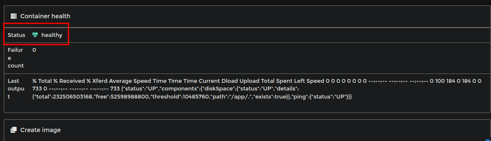

## Healthcheck

Um health check é uma técnica utilizada em sistemas de computação para monitorar o estado de um componente, como um aplicativo, serviço, servidor ou contêiner. Ele é usado para verificar se o componente está funcionando conforme o esperado e se está disponível para aceitar solicitações de usuários ou outros componentes do sistema.

### Como implementar o healthcheck

No exemplo usarei um projeto Spring Boot, seguirei os seguintes passos:

1. Adicionar dependencia no `pom.xml` :

```
<dependency>
	<groupId>org.springframework.boot</groupId>
        <artifactId>spring-boot-starter-actuator</artifactId>
</dependency>
```

2. Modificar `Dockerfile`, nesse arquivo precisamos instalar o curl e adicionar o healthcheck, ao final das modificações o arquivo completo ficou assim:

```
FROM openjdk:17-jdk-slim
COPY target/keycloakauth-0.0.1-SNAPSHOT.jar /app/keycloakauth-0.0.1-SNAPSHOT.jar
WORKDIR /app
EXPOSE 8340

RUN \
  apt-get update &&  \
  apt-get install curl -y && \
  apt-get clean

ENTRYPOINT ["java", "-jar", "keycloakauth-0.0.1-SNAPSHOT.jar"]
HEALTHCHECK --interval=25s --timeout=3s --retries=5 CMD curl -f http://localhost:${ACTUATOR_PORT}/actuator/health || exit 1

```

3. Modificar o `application.yml`, devemos definir como estará configurado o actuator, no caso estou usando essa configuração:

```
management:
  server:
    port: ${ACTUATOR_PORT:8081}
  endpoint:
    health:
      show-details: always
  endpoints:
    web:
      exposure:
        include: info, health, loggers, metrics
```

4. Segurança (caso exista configuração do spring security), nesse caso devemos liberar as requisições do actuator:

No arquivo de configuração `SecurityConfig` (ou o que estiver definido no projeto), irei alterar para public o `/actuator/**`

Ao final a classe completa ficou assim:

```
@Configuration
@EnableWebSecurity
@EnableMethodSecurity
public class SecurityConfig {

   	@Bean
	public SecurityFilterChain securityFilterChain(HttpSecurity http) throws Exception {
        String[] permitAll = { "/api/auth", "/api/auth/create-new-user", "/actuator/**" };

        return http
            .csrf(AbstractHttpConfigurer::disable)
            .oauth2ResourceServer(oauth2 -> oauth2.
                jwt(jwt -> jwt.jwtAuthenticationConverter(new JwtConverter())))
            .authorizeHttpRequests(authorize -> authorize
                .requestMatchers("/api/products/create")
                .hasAnyRole(ERoles.ADMIN.name())
                .requestMatchers("/api/products")
                .hasAnyRole(ERoles.USER.name(), ERoles.ADMIN.name())
                .requestMatchers(permitAll).permitAll()
                .anyRequest().authenticated()
            )
            .build();
	 }
}
```

### Conclusão

Após os passos acima, suba a aplicação recriando a imagem e container. após ele startar, deverá apresentar como `healthy`


